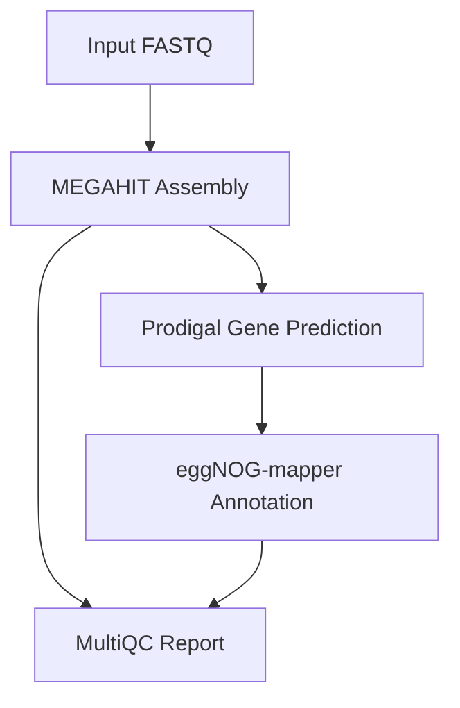

# Symbiont Discovery Pipeline - Usage Guide

## Overview

This Nextflow DSL2 pipeline performs metagenomics analysis for marine symbiotic consortia discovery. It includes:

1. **Assembly**: MEGAHIT for metagenomic assembly
2. **Gene Prediction**: Prodigal for protein-coding gene identification
3. **Functional Annotation**: eggNOG-mapper for comprehensive functional annotation
4. **Quality Control**: MultiQC for aggregated quality reports

## Quick Start

### Prerequisites

- Nextflow ≥ 21.10.0
- Docker, Singularity, or Conda (choose one)
- eggNOG database (download instructions below)

### Installation

```bash
# Clone the repository
git clone https://github.com/nohaelkayal/symbiont-discovery-pipeline.git
cd symbiont-discovery-pipeline

# Download eggNOG database (one-time setup)
mkdir -p databases/eggnog
download_eggnog_data.py -y --data_dir databases/eggnog
```

### Running the Pipeline

#### Basic Usage

```bash
nextflow run main.nf \
    --input samplesheet.csv \
    --outdir results \
    --eggnog_db databases/eggnog \
    -profile docker
```

#### With Singularity

```bash
nextflow run main.nf \
    --input samplesheet.csv \
    --outdir results \
    --eggnog_db databases/eggnog \
    -profile singularity
```

#### With Conda

```bash
nextflow run main.nf \
    --input samplesheet.csv \
    --outdir results \
    --eggnog_db databases/eggnog \
    -profile conda
```

## Input Specification

### Samplesheet Format

Create a CSV file with the following columns:

```csv
sample,fastq_1,fastq_2
sample1,/path/to/sample1_R1.fastq.gz,/path/to/sample1_R2.fastq.gz
sample2,/path/to/sample2_R1.fastq.gz,/path/to/sample2_R2.fastq.gz
```

For single-end reads, omit the `fastq_2` column:

```csv
sample,fastq_1
sample1,/path/to/sample1.fastq.gz
sample2,/path/to/sample2.fastq.gz
```

## Parameters

### Required Parameters

| Parameter | Description |
|-----------|-------------|
| `--input` | Path to input samplesheet (CSV format) |
| `--outdir` | Output directory for results |
| `--eggnog_db` | Path to eggNOG database directory |

### Assembly Options

| Parameter | Default | Description |
|-----------|---------|-------------|
| `--assembler` | `megahit` | Assembler to use [megahit, spades] |
| `--min_contig_length` | `1000` | Minimum contig length to retain |

### Annotation Options

| Parameter | Default | Description |
|-----------|---------|-------------|
| `--annotation_method` | `eggnog` | Annotation method [eggnog, diamond, both] |

### Resource Options

| Parameter | Default | Description |
|-----------|---------|-------------|
| `--max_cpus` | `16` | Maximum CPUs per process |
| `--max_memory` | `128.GB` | Maximum memory per process |
| `--max_time` | `240.h` | Maximum time per process |

## Output Structure

```
results/
├── assembly/
│   ├── {sample_id}/
│   │   ├── final.contigs.fa      # Assembled contigs
│   │   └── log/                  # Assembly logs
├── gene_prediction/
│   ├── {sample_id}.faa           # Predicted proteins
│   ├── {sample_id}.fna           # Predicted genes
│   └── {sample_id}.gff           # Gene annotations (GFF format)
├── functional_annotation/
│   ├── {sample_id}.emapper.annotations   # Functional annotations
│   └── {sample_id}.emapper.seed_orthologs # Ortholog assignments
├── multiqc/
│   ├── multiqc_report.html       # Aggregated QC report
│   └── multiqc_data/             # Raw QC data
└── pipeline_info/
    ├── execution_timeline.html   # Execution timeline
    ├── execution_report.html     # Resource usage report
    └── execution_trace.txt       # Detailed execution trace
```

## Pipeline Workflow



## Process Details

### 1. MEGAHIT Assembly

- **Tool**: MEGAHIT v1.2.9
- **Purpose**: Metagenomic de novo assembly
- **Key Options**:
  - Multi-threaded execution
  - Configurable minimum contig length
  - Memory-efficient k-mer based assembly

### 2. Prodigal Gene Prediction

- **Tool**: Prodigal v2.6.3
- **Purpose**: Protein-coding gene identification
- **Mode**: Metagenomics mode (`-p meta`)
- **Outputs**:
  - Protein sequences (FASTA)
  - Nucleotide sequences (FASTA)
  - Gene features (GFF)

### 3. eggNOG-mapper Annotation

- **Tool**: eggNOG-mapper v2.1.12
- **Purpose**: Functional annotation using eggNOG database
- **Features**:
  - Orthology assignment
  - GO terms
  - KEGG pathways
  - Protein domains

### 4. MultiQC Report

- **Tool**: MultiQC v1.23
- **Purpose**: Aggregate quality control metrics
- **Includes**:
  - Assembly statistics
  - Process execution summaries

## Configuration Profiles

### Docker (Recommended)

```bash
nextflow run main.nf -profile docker
```

- Uses official Biocontainers images
- Automatic container pulling
- Best reproducibility

### Singularity

```bash
nextflow run main.nf -profile singularity
```

- For HPC environments
- Converts Docker images to Singularity format
- Cached containers in `work/singularity/`

### Conda

```bash
nextflow run main.nf -profile conda
```

- Creates isolated conda environments
- Longer initial setup time
- Good for systems without container support

### Test Profile

```bash
nextflow run main.nf -profile test
```

- Uses minimal test data
- Quick validation run
- Useful for pipeline testing

## Troubleshooting

### Common Issues

#### 1. eggNOG Database Not Found

**Error**: `Cannot find eggnog database`

**Solution**: Download the eggNOG database:
```bash
mkdir -p databases/eggnog
download_eggnog_data.py -y --data_dir databases/eggnog
```

#### 2. Out of Memory

**Error**: Process killed due to memory limit

**Solution**: Increase memory allocation in `nextflow.config` or use the `--max_memory` parameter:
```bash
nextflow run main.nf --max_memory 256.GB
```

#### 3. Container Pull Errors

**Error**: Failed to pull Docker container

**Solution**: Pre-pull containers manually:
```bash
docker pull biocontainers/megahit:1.2.9--h8b12597_0
docker pull biocontainers/prodigal:2.6.3--h516909a_2
docker pull biocontainers/eggnog-mapper:2.1.12--pyhdfd78af_0
docker pull biocontainers/multiqc:1.23--pyhdfd78af_0
```

## Resource Requirements

### Minimum Requirements

- CPU: 4 cores
- RAM: 16 GB
- Storage: 50 GB + (2x input data size)

### Recommended Configuration

- CPU: 16+ cores
- RAM: 64+ GB
- Storage: 200 GB + (4x input data size)

## Performance Tips

1. **Use SSD storage** for the work directory
2. **Pre-download databases** before running production jobs
3. **Enable resume** with `-resume` flag for interrupted runs
4. **Monitor resources** using the execution report

## Citation

If you use this pipeline, please cite:

- **Nextflow**: Di Tommaso et al. (2017) Nature Biotechnology
- **MEGAHIT**: Li et al. (2015) Bioinformatics
- **Prodigal**: Hyatt et al. (2010) BMC Bioinformatics
- **eggNOG-mapper**: Huerta-Cepas et al. (2019) Molecular Biology and Evolution
- **MultiQC**: Ewels et al. (2016) Bioinformatics

## Support

For issues and questions:
- GitHub Issues: https://github.com/nohaelkayal/symbiont-discovery-pipeline/issues
- Documentation: https://github.com/nohaelkayal/symbiont-discovery-pipeline

## License

This pipeline is released under the MIT License.
